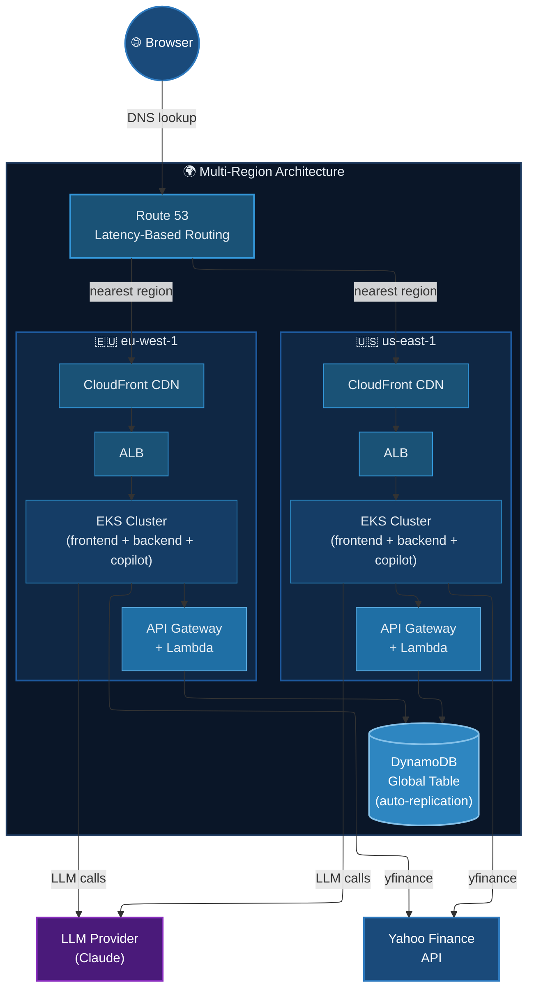

# AWS Deployment (Large Scale) — EKS

## Overview

Deploy the full-stack app to Amazon EKS (Elastic Kubernetes Service) for production
at scale (50,000–500,000+ users, multi-region). This guide covers:

- Amazon ECR for container images
- Amazon EKS cluster with managed node groups
- Kubernetes Deployments, Services, and Ingress
- AWS Load Balancer Controller for ALB integration
- Horizontal Pod Autoscaler (HPA) for auto-scaling each service independently
- CloudFront CDN for global edge caching
- Multi-region expansion strategy

## When to Use This vs. ECS Fargate (MVP)

| Factor | ECS Fargate (MVP) | EKS (This Guide) |
|--------|-------------------|-------------------|
| Users | 1–50,000 | 50,000–500,000+ |
| Containers | All-in-one task | Independent Deployments per service |
| Scaling | Task-level (all 3 scale together) | Per-service (backend scales independently) |
| Cost optimization | Limited | Spot instances, Karpenter, right-sizing |
| Multi-region | Not practical | Supported with federation |
| Deployment strategies | Rolling only | Canary, blue/green, A/B |
| Complexity | Low | High |
| Cost | ~$25/mo | ~$100–300/mo minimum |

## Naming Convention

All resources use the `cookiecutter-test-` prefix.

| Resource                    | Name                                      |
|-----------------------------|-------------------------------------------|
| ECR Repo (backend)          | `cookiecutter-test-backend`               |
| ECR Repo (frontend)         | `cookiecutter-test-frontend`              |
| ECR Repo (copilot)          | `cookiecutter-test-copilot`               |
| EKS Cluster                 | `cookiecutter-test-eks-cluster`           |
| Node Group                  | `cookiecutter-test-node-group`            |
| Kubernetes Namespace        | `cookiecutter-test`                       |
| CloudFront Distribution     | `cookiecutter-test-cdn`                   |
| IAM Role (EKS Cluster)      | `cookiecutter-test-eks-cluster-role`      |
| IAM Role (Node Group)       | `cookiecutter-test-eks-node-role`         |
| IAM Role (ALB Controller)   | `cookiecutter-test-alb-controller-role`   |

Region (primary): `us-east-1`

---

## Prerequisites

- AWS CLI installed and authenticated
- `kubectl` installed ([docs](https://kubernetes.io/docs/tasks/tools/))
- `eksctl` installed ([docs](https://eksctl.io/installation/))
- `helm` installed ([docs](https://helm.sh/docs/intro/install/))
- Docker running locally

---

## Phase 1 — Create ECR Repositories

Skip if already created from MVP guide.

```bash
aws ecr create-repository --repository-name cookiecutter-test-backend --region us-east-1
aws ecr create-repository --repository-name cookiecutter-test-frontend --region us-east-1
aws ecr create-repository --repository-name cookiecutter-test-copilot --region us-east-1
```

## Phase 2 — Build & Push Docker Images

Login to ECR:

```bash
AWS_ACCOUNT_ID=$(aws sts get-caller-identity --query Account --output text)
aws ecr get-login-password --region us-east-1 | \
  docker login --username AWS --password-stdin $AWS_ACCOUNT_ID.dkr.ecr.us-east-1.amazonaws.com
```

For EKS, each container runs as a separate pod — they communicate via Kubernetes
Service DNS names (e.g., `backend-service:8000`), not localhost.

Create `frontend/nginx.eks.conf`:

```nginx
server {
    listen 80;
    server_name localhost;

    gzip on;
    gzip_types text/plain text/css application/json application/javascript text/xml application/xml application/xml+rss text/javascript;
    gzip_min_length 256;

    location / {
        root   /usr/share/nginx/html;
        index  index.html;
        try_files $uri $uri/ /index.html;
    }

    location /api/ {
        proxy_pass http://cookiecutter-test-backend-svc:8000/api/;
        proxy_set_header Host $host;
        proxy_set_header X-Real-IP $remote_addr;
        proxy_set_header X-Forwarded-For $proxy_add_x_forwarded_for;
        proxy_set_header X-Forwarded-Proto $scheme;
    }

    location /copilotkit {
        proxy_pass http://cookiecutter-test-copilot-svc:4001/copilotkit;
        proxy_set_header Host $host;
        proxy_set_header X-Real-IP $remote_addr;
        proxy_set_header X-Forwarded-For $proxy_add_x_forwarded_for;
        proxy_set_header X-Forwarded-Proto $scheme;
        proxy_http_version 1.1;
        proxy_set_header Upgrade $http_upgrade;
        proxy_set_header Connection "upgrade";
        proxy_read_timeout 300s;
    }
}
```

Create `frontend/Dockerfile.eks`:

```dockerfile
# Stage 1: Build
FROM node:20-alpine AS build
WORKDIR /app
COPY package*.json ./
RUN npm install
COPY . .
RUN npm run build

# Stage 2: Serve
FROM nginx:alpine
COPY --from=build /app/dist /usr/share/nginx/html
COPY nginx.eks.conf /etc/nginx/conf.d/default.conf
EXPOSE 80
CMD ["nginx", "-g", "daemon off;"]
```

Build and push:

```bash
ECR=$AWS_ACCOUNT_ID.dkr.ecr.us-east-1.amazonaws.com

# Backend
docker tag deployment-backend $ECR/cookiecutter-test-backend:latest
docker push $ECR/cookiecutter-test-backend:latest

# Frontend (build with EKS Dockerfile)
cd frontend
docker build -f Dockerfile.eks -t $ECR/cookiecutter-test-frontend:latest .
docker push $ECR/cookiecutter-test-frontend:latest
cd ..

# Copilot
docker tag deployment-copilot $ECR/cookiecutter-test-copilot:latest
docker push $ECR/cookiecutter-test-copilot:latest
```

## Phase 3 — Create EKS Cluster

Using `eksctl` for simplicity. This creates the cluster, VPC, subnets, and node group.

Create `deployment/eks-cluster.yaml`:

```yaml
apiVersion: eksctl.io/v1alpha5
kind: ClusterConfig

metadata:
  name: cookiecutter-test-eks-cluster
  region: us-east-1

managedNodeGroups:
  - name: cookiecutter-test-node-group
    instanceType: t3.medium
    desiredCapacity: 2
    minSize: 1
    maxSize: 5
    volumeSize: 20
    labels:
      role: worker
    tags:
      project: cookiecutter-test

iam:
  withOIDC: true
```

Create the cluster (takes 15-20 minutes):

```bash
eksctl create cluster -f deployment/eks-cluster.yaml
```

Verify:

```bash
kubectl get nodes
# Should show 2 nodes in Ready state
```

## Phase 4 — Install AWS Load Balancer Controller

The ALB Controller lets Kubernetes Ingress resources create ALBs automatically.

```bash
# Create IAM policy for the controller
curl -o /tmp/alb-iam-policy.json \
  https://raw.githubusercontent.com/kubernetes-sigs/aws-load-balancer-controller/main/docs/install/iam_policy.json

aws iam create-policy \
  --policy-name cookiecutter-test-alb-controller-policy \
  --policy-document file:///tmp/alb-iam-policy.json

# Create service account with IAM role
eksctl create iamserviceaccount \
  --cluster cookiecutter-test-eks-cluster \
  --namespace kube-system \
  --name aws-load-balancer-controller \
  --attach-policy-arn arn:aws:iam::${AWS_ACCOUNT_ID}:policy/cookiecutter-test-alb-controller-policy \
  --approve

# Install via Helm
helm repo add eks https://aws.github.io/eks-charts
helm repo update

helm install aws-load-balancer-controller eks/aws-load-balancer-controller \
  --namespace kube-system \
  --set clusterName=cookiecutter-test-eks-cluster \
  --set serviceAccount.create=false \
  --set serviceAccount.name=aws-load-balancer-controller

# Verify
kubectl get deployment -n kube-system aws-load-balancer-controller
```

## Phase 5 — Create Kubernetes Namespace and Secrets

```bash
kubectl create namespace cookiecutter-test
```

Create secrets from your `.env` file:

```bash
kubectl create secret generic cookiecutter-test-secrets \
  --namespace cookiecutter-test \
  --from-literal=DYNAMODB_API_URL="<your-value>" \
  --from-literal=DYNAMODB_API_KEY="<your-value>" \
  --from-literal=ANTHROPIC_API_KEY="<your-value>" \
  --from-literal=CLAUDE_API_KEY="<your-value>"
```

## Phase 6 — Deploy Kubernetes Manifests

Create `deployment/k8s/` directory for all manifests.

### Backend Deployment & Service (`deployment/k8s/backend.yaml`)

```yaml
apiVersion: apps/v1
kind: Deployment
metadata:
  name: cookiecutter-test-backend
  namespace: cookiecutter-test
  labels:
    app: cookiecutter-test-backend
spec:
  replicas: 2
  selector:
    matchLabels:
      app: cookiecutter-test-backend
  template:
    metadata:
      labels:
        app: cookiecutter-test-backend
    spec:
      containers:
        - name: backend
          image: <AWS_ACCOUNT_ID>.dkr.ecr.us-east-1.amazonaws.com/cookiecutter-test-backend:latest
          ports:
            - containerPort: 8000
          envFrom:
            - secretRef:
                name: cookiecutter-test-secrets
          resources:
            requests:
              cpu: "256m"
              memory: "512Mi"
            limits:
              cpu: "512m"
              memory: "1Gi"
          readinessProbe:
            httpGet:
              path: /api/health
              port: 8000
            initialDelaySeconds: 10
            periodSeconds: 10
          livenessProbe:
            httpGet:
              path: /api/health
              port: 8000
            initialDelaySeconds: 15
            periodSeconds: 20
---
apiVersion: v1
kind: Service
metadata:
  name: cookiecutter-test-backend-svc
  namespace: cookiecutter-test
spec:
  selector:
    app: cookiecutter-test-backend
  ports:
    - port: 8000
      targetPort: 8000
  type: ClusterIP
```

### Copilot Deployment & Service (`deployment/k8s/copilot.yaml`)

```yaml
apiVersion: apps/v1
kind: Deployment
metadata:
  name: cookiecutter-test-copilot
  namespace: cookiecutter-test
  labels:
    app: cookiecutter-test-copilot
spec:
  replicas: 2
  selector:
    matchLabels:
      app: cookiecutter-test-copilot
  template:
    metadata:
      labels:
        app: cookiecutter-test-copilot
    spec:
      containers:
        - name: copilot
          image: <AWS_ACCOUNT_ID>.dkr.ecr.us-east-1.amazonaws.com/cookiecutter-test-copilot:latest
          ports:
            - containerPort: 4001
          envFrom:
            - secretRef:
                name: cookiecutter-test-secrets
          resources:
            requests:
              cpu: "256m"
              memory: "512Mi"
            limits:
              cpu: "512m"
              memory: "1Gi"
---
apiVersion: v1
kind: Service
metadata:
  name: cookiecutter-test-copilot-svc
  namespace: cookiecutter-test
spec:
  selector:
    app: cookiecutter-test-copilot
  ports:
    - port: 4001
      targetPort: 4001
  type: ClusterIP
```

### Frontend Deployment & Service (`deployment/k8s/frontend.yaml`)

```yaml
apiVersion: apps/v1
kind: Deployment
metadata:
  name: cookiecutter-test-frontend
  namespace: cookiecutter-test
  labels:
    app: cookiecutter-test-frontend
spec:
  replicas: 2
  selector:
    matchLabels:
      app: cookiecutter-test-frontend
  template:
    metadata:
      labels:
        app: cookiecutter-test-frontend
    spec:
      containers:
        - name: frontend
          image: <AWS_ACCOUNT_ID>.dkr.ecr.us-east-1.amazonaws.com/cookiecutter-test-frontend:latest
          ports:
            - containerPort: 80
          resources:
            requests:
              cpu: "128m"
              memory: "256Mi"
            limits:
              cpu: "256m"
              memory: "512Mi"
---
apiVersion: v1
kind: Service
metadata:
  name: cookiecutter-test-frontend-svc
  namespace: cookiecutter-test
spec:
  selector:
    app: cookiecutter-test-frontend
  ports:
    - port: 80
      targetPort: 80
  type: ClusterIP
```

### Ingress (`deployment/k8s/ingress.yaml`)

This creates an internet-facing ALB via the AWS Load Balancer Controller:

```yaml
apiVersion: networking.k8s.io/v1
kind: Ingress
metadata:
  name: cookiecutter-test-ingress
  namespace: cookiecutter-test
  annotations:
    kubernetes.io/ingress.class: alb
    alb.ingress.kubernetes.io/scheme: internet-facing
    alb.ingress.kubernetes.io/target-type: ip
    alb.ingress.kubernetes.io/healthcheck-path: /api/health
    alb.ingress.kubernetes.io/listen-ports: '[{"HTTP": 80}]'
spec:
  rules:
    - http:
        paths:
          - path: /
            pathType: Prefix
            backend:
              service:
                name: cookiecutter-test-frontend-svc
                port:
                  number: 80
```

### Apply all manifests

```bash
# Replace <AWS_ACCOUNT_ID> in yaml files first
AWS_ACCOUNT_ID=$(aws sts get-caller-identity --query Account --output text)

sed -i "s/<AWS_ACCOUNT_ID>/$AWS_ACCOUNT_ID/g" deployment/k8s/*.yaml

# Apply
kubectl apply -f deployment/k8s/backend.yaml
kubectl apply -f deployment/k8s/copilot.yaml
kubectl apply -f deployment/k8s/frontend.yaml
kubectl apply -f deployment/k8s/ingress.yaml
```

### Verify

```bash
# Check pods
kubectl get pods -n cookiecutter-test

# Check services
kubectl get svc -n cookiecutter-test

# Get ALB URL (takes 2-3 minutes to provision)
kubectl get ingress -n cookiecutter-test
# The ADDRESS column shows the ALB DNS name

# Test
ALB_DNS=$(kubectl get ingress cookiecutter-test-ingress -n cookiecutter-test \
  -o jsonpath='{.status.loadBalancer.ingress[0].hostname}')
curl -s http://$ALB_DNS/api/health
```

## Phase 7 — Horizontal Pod Autoscaler (HPA)

Scale each service independently based on CPU usage.

### Install Metrics Server (required for HPA)

```bash
kubectl apply -f https://github.com/kubernetes-sigs/metrics-server/releases/latest/download/components.yaml
```

### Create HPA for each service (`deployment/k8s/hpa.yaml`)

```yaml
apiVersion: autoscaling/v2
kind: HorizontalPodAutoscaler
metadata:
  name: cookiecutter-test-backend-hpa
  namespace: cookiecutter-test
spec:
  scaleTargetRef:
    apiVersion: apps/v1
    kind: Deployment
    name: cookiecutter-test-backend
  minReplicas: 2
  maxReplicas: 10
  metrics:
    - type: Resource
      resource:
        name: cpu
        target:
          type: Utilization
          averageUtilization: 70
---
apiVersion: autoscaling/v2
kind: HorizontalPodAutoscaler
metadata:
  name: cookiecutter-test-copilot-hpa
  namespace: cookiecutter-test
spec:
  scaleTargetRef:
    apiVersion: apps/v1
    kind: Deployment
    name: cookiecutter-test-copilot
  minReplicas: 2
  maxReplicas: 8
  metrics:
    - type: Resource
      resource:
        name: cpu
        target:
          type: Utilization
          averageUtilization: 70
---
apiVersion: autoscaling/v2
kind: HorizontalPodAutoscaler
metadata:
  name: cookiecutter-test-frontend-hpa
  namespace: cookiecutter-test
spec:
  scaleTargetRef:
    apiVersion: apps/v1
    kind: Deployment
    name: cookiecutter-test-frontend
  minReplicas: 2
  maxReplicas: 6
  metrics:
    - type: Resource
      resource:
        name: cpu
        target:
          type: Utilization
          averageUtilization: 70
```

```bash
kubectl apply -f deployment/k8s/hpa.yaml

# Monitor scaling
kubectl get hpa -n cookiecutter-test
```

## Phase 8 — Cluster Autoscaler (Node Scaling)

HPA scales pods; Cluster Autoscaler scales nodes when pods can't be scheduled.

```bash
eksctl create iamserviceaccount \
  --cluster cookiecutter-test-eks-cluster \
  --namespace kube-system \
  --name cluster-autoscaler \
  --attach-policy-arn arn:aws:iam::aws:policy/AutoScalingFullAccess \
  --approve

helm repo add autoscaler https://kubernetes.github.io/autoscaler
helm repo update

helm install cluster-autoscaler autoscaler/cluster-autoscaler \
  --namespace kube-system \
  --set autoDiscovery.clusterName=cookiecutter-test-eks-cluster \
  --set awsRegion=us-east-1 \
  --set rbac.serviceAccount.create=false \
  --set rbac.serviceAccount.name=cluster-autoscaler
```

## Phase 9 — (Optional) CloudFront CDN

Put CloudFront in front of the ALB for global edge caching (static assets, API caching).

```bash
ALB_DNS=$(kubectl get ingress cookiecutter-test-ingress -n cookiecutter-test \
  -o jsonpath='{.status.loadBalancer.ingress[0].hostname}')

aws cloudfront create-distribution \
  --distribution-config "{
    \"CallerReference\": \"cookiecutter-test-$(date +%s)\",
    \"Comment\": \"cookiecutter-test-cdn\",
    \"Enabled\": true,
    \"Origins\": {
      \"Quantity\": 1,
      \"Items\": [{
        \"Id\": \"alb-origin\",
        \"DomainName\": \"$ALB_DNS\",
        \"CustomOriginConfig\": {
          \"HTTPPort\": 80,
          \"HTTPSPort\": 443,
          \"OriginProtocolPolicy\": \"http-only\"
        }
      }]
    },
    \"DefaultCacheBehavior\": {
      \"TargetOriginId\": \"alb-origin\",
      \"ViewerProtocolPolicy\": \"redirect-to-https\",
      \"AllowedMethods\": {
        \"Quantity\": 7,
        \"Items\": [\"GET\",\"HEAD\",\"OPTIONS\",\"PUT\",\"POST\",\"PATCH\",\"DELETE\"],
        \"CachedMethods\": {\"Quantity\": 2, \"Items\": [\"GET\",\"HEAD\"]}
      },
      \"ForwardedValues\": {
        \"QueryString\": true,
        \"Cookies\": {\"Forward\": \"none\"},
        \"Headers\": {\"Quantity\": 3, \"Items\": [\"Authorization\",\"Host\",\"Origin\"]}
      },
      \"MinTTL\": 0,
      \"DefaultTTL\": 0,
      \"MaxTTL\": 0
    },
    \"CacheBehaviors\": {
      \"Quantity\": 1,
      \"Items\": [{
        \"PathPattern\": \"/assets/*\",
        \"TargetOriginId\": \"alb-origin\",
        \"ViewerProtocolPolicy\": \"redirect-to-https\",
        \"AllowedMethods\": {\"Quantity\": 2, \"Items\": [\"GET\",\"HEAD\"]},
        \"ForwardedValues\": {\"QueryString\": false, \"Cookies\": {\"Forward\": \"none\"}},
        \"MinTTL\": 86400,
        \"DefaultTTL\": 604800,
        \"MaxTTL\": 2592000
      }]
    },
    \"PriceClass\": \"PriceClass_100\"
  }" --region us-east-1
```

This caches static assets (`/assets/*`) at edge locations for 7 days while API
requests pass through uncached.

## Phase 10 — (Optional) Multi-Region Expansion

For 100,000+ users across multiple countries:

### Strategy

```
                    Route 53 (Latency-based routing)
                    /                              \
                   v                                v
        us-east-1 Cluster                 eu-west-1 Cluster
        (EKS + ALB + CloudFront)          (EKS + ALB + CloudFront)
              |                                  |
              v                                  v
        DynamoDB Global Table (auto-replicates between regions)
```

### Steps

1. **DynamoDB Global Tables** — replicate `cookiecutter-test-table-v1` to `eu-west-1`:

```bash
aws dynamodb create-table \
  --table-name cookiecutter-test-table-v1 \
  --attribute-definitions AttributeName=username,AttributeType=S \
  --key-schema AttributeName=username,KeyType=HASH \
  --billing-mode PAY_PER_REQUEST \
  --region eu-west-1

aws dynamodb create-global-table \
  --global-table-name cookiecutter-test-table-v1 \
  --replication-group RegionName=us-east-1 RegionName=eu-west-1
```

2. **Deploy EKS cluster in eu-west-1** — repeat Phases 3-8 with `--region eu-west-1`.

3. **Route 53 latency-based routing** — route users to nearest region:

```bash
# Create hosted zone (if you have a domain)
aws route53 create-hosted-zone --name myapp.example.com --caller-reference $(date +%s)

# Create latency-based records pointing to each region's ALB/CloudFront
# US record
aws route53 change-resource-record-sets --hosted-zone-id <ZONE_ID> --change-batch '{
  "Changes": [{
    "Action": "CREATE",
    "ResourceRecordSet": {
      "Name": "myapp.example.com",
      "Type": "A",
      "SetIdentifier": "us-east-1",
      "Region": "us-east-1",
      "AliasTarget": {
        "HostedZoneId": "<ALB_ZONE_ID>",
        "DNSName": "<US_ALB_DNS>",
        "EvaluateTargetHealth": true
      }
    }
  }]
}'
```

4. **Deploy Lambda + API Gateway per region** — each region's backend talks to its local
   API Gateway → Lambda → DynamoDB (global table handles replication).

---

## Troubleshooting

### Check pod status

```bash
kubectl get pods -n cookiecutter-test
kubectl describe pod <POD_NAME> -n cookiecutter-test
kubectl logs <POD_NAME> -n cookiecutter-test -c backend
```

### Check HPA scaling

```bash
kubectl get hpa -n cookiecutter-test
kubectl describe hpa cookiecutter-test-backend-hpa -n cookiecutter-test
```

### Check Ingress/ALB

```bash
kubectl describe ingress cookiecutter-test-ingress -n cookiecutter-test
kubectl logs -n kube-system deployment/aws-load-balancer-controller
```

### Common issues

- **Pods stuck in Pending:** Node group may be at capacity. Check Cluster Autoscaler logs.
- **ImagePullBackOff:** ECR auth issue. Ensure nodes have ECR pull permissions.
- **ALB not created:** Check ALB Controller logs. Ensure OIDC provider is configured.
- **502 from ALB:** Backend pods not ready. Check readiness probe and pod logs.
- **DNS resolution between services:** Ensure services are in the same namespace and use correct service names.

---

## Architecture Diagram

### Single Region



```mermaid
%%{init: {"flowchart": {"defaultRenderer": "elk"}} }%%

flowchart LR
    subgraph AWS["☁️ AWS — EKS (Single Region, us-east-1)"]
        direction LR

        CDN["CloudFront CDN\n(caches /assets/*)"]
        ALB["Application\nLoad Balancer\n(via Ingress)"]

        subgraph EKS["EKS Cluster — cookiecutter-test-eks-cluster"]
            direction TB

            subgraph NS["Namespace: cookiecutter-test"]
                direction TB

                subgraph FE["FRONTEND DEPLOYMENT  (2–6 pods)"]
                    direction TB
                    FE_NGINX["Nginx\nServes SPA &\nreverse-proxies"]
                    FE_REACT["React App\n(static build)"]
                end

                subgraph BE["BACKEND DEPLOYMENT  (2–10 pods)"]
                    direction TB
                    BE_API["FastAPI\n(Uvicorn)"]
                    BE_AUTH["Auth Endpoints\n/api/auth/*"]
                    BE_STOCK["Stock Endpoints\n/api/stock/*"]
                end

                subgraph CP["COPILOT DEPLOYMENT  (2–8 pods)"]
                    direction TB
                    CP_RUNTIME["CopilotKit\nRuntime\n(Node.js)"]
                end

                HPA_BE["HPA\nBackend\n(CPU 70%)"]
                HPA_CP["HPA\nCopilot\n(CPU 70%)"]
                HPA_FE["HPA\nFrontend\n(CPU 70%)"]
            end
        end
    end

    BROWSER(("🌐 Browser"))
    APIGW["AWS API Gateway\n+ Lambda"]
    DYNAMO[("DynamoDB\ncookiecutter-test-table-v1")]
    YAHOO["Yahoo Finance\nAPI"]
    LLM["LLM Provider\n(Claude)"]

    BROWSER -- "HTTPS" --> CDN
    CDN -- "origin" --> ALB
    ALB -- "Ingress\nport 80" --> FE_NGINX
    FE_NGINX -- "static files" --> FE_REACT
    FE_NGINX -- "/api/* proxy\nbackend-svc:8000" --> BE_API
    FE_NGINX -- "/copilotkit proxy\ncopilot-svc:4001" --> CP_RUNTIME
    BE_API --> BE_AUTH
    BE_API --> BE_STOCK
    BE_AUTH -- "HTTPS" --> APIGW
    APIGW --> DYNAMO
    BE_STOCK -- "yfinance" --> YAHOO
    CP_RUNTIME -- "LLM calls" --> LLM
    HPA_BE -. "scales" .-> BE
    HPA_CP -. "scales" .-> CP
    HPA_FE -. "scales" .-> FE

    %% Blue gradient styles
    style AWS fill:#0a1628,stroke:#1e3a5f,stroke-width:2px,color:#e6edf3
    style EKS fill:#0d1f3c,stroke:#1e4a7f,stroke-width:2px,color:#e6edf3
    style NS fill:#111d33,stroke:#1e3a6f,stroke-width:1px,color:#e6edf3
    style FE fill:#0f2744,stroke:#1e5a9f,stroke-width:2px,color:#e6edf3
    style BE fill:#0f2744,stroke:#1e5a9f,stroke-width:2px,color:#e6edf3
    style CP fill:#1a0f44,stroke:#5a1e9f,stroke-width:2px,color:#e6edf3
    style CDN fill:#1a5276,stroke:#3498db,stroke-width:2px,color:#e6edf3
    style ALB fill:#1a5276,stroke:#3498db,stroke-width:2px,color:#e6edf3
    style BROWSER fill:#1a4a7a,stroke:#2e7abf,stroke-width:2px,color:#ffffff
    style YAHOO fill:#1a4a7a,stroke:#2e7abf,stroke-width:2px,color:#ffffff
    style LLM fill:#4a1a7a,stroke:#8a2ebf,stroke-width:2px,color:#ffffff
    style APIGW fill:#1a5276,stroke:#3498db,stroke-width:1px,color:#e6edf3
    style DYNAMO fill:#2e86c1,stroke:#85c1e9,stroke-width:1px,color:#ffffff
    style FE_NGINX fill:#1a5276,stroke:#3498db,stroke-width:1px,color:#e6edf3
    style FE_REACT fill:#153d66,stroke:#2980b9,stroke-width:1px,color:#e6edf3
    style BE_API fill:#1a5276,stroke:#3498db,stroke-width:1px,color:#e6edf3
    style BE_AUTH fill:#1f6fa5,stroke:#5dade2,stroke-width:1px,color:#e6edf3
    style BE_STOCK fill:#2580c3,stroke:#7ec8e3,stroke-width:1px,color:#e6edf3
    style CP_RUNTIME fill:#2d1566,stroke:#7b4fbf,stroke-width:1px,color:#e6edf3
    style HPA_BE fill:#1fa575,stroke:#5de2a2,stroke-width:1px,color:#e6edf3
    style HPA_CP fill:#1fa575,stroke:#5de2a2,stroke-width:1px,color:#e6edf3
    style HPA_FE fill:#1fa575,stroke:#5de2a2,stroke-width:1px,color:#e6edf3
```

### Multi-Region



---

## Cost Estimate

### Single Region

| Resource                        | Cost           |
|---------------------------------|----------------|
| EKS Control Plane               | ~$73/month     |
| EC2 Nodes (2x t3.medium)       | ~$60/month     |
| ALB                             | ~$8/month      |
| ECR (3 repos)                   | ~$1/month      |
| CloudWatch Logs                 | ~$5/month      |
| CloudFront (optional)           | ~$5-20/month   |
| **Total (single region)**       | **~$150-170/month** |

### Multi-Region (2 regions)

| Resource                        | Cost           |
|---------------------------------|----------------|
| 2x EKS clusters                | ~$300/month    |
| DynamoDB Global Tables          | ~$10-50/month  |
| 2x CloudFront                  | ~$10-40/month  |
| Route 53                        | ~$1/month      |
| **Total (2 regions)**           | **~$320-400/month** |

### Cost Optimization Tips

- **Spot instances:** Use spot for non-critical workloads (70% savings on EC2).
  Add to `eks-cluster.yaml`:
  ```yaml
  managedNodeGroups:
    - name: cookiecutter-test-spot-group
      instanceTypes: [t3.medium, t3.large, t3a.medium]
      spot: true
      desiredCapacity: 2
  ```
- **Karpenter:** Replace Cluster Autoscaler for smarter, faster node scaling.
- **Fargate profiles:** Run low-traffic services on Fargate (no idle node cost).
- **Reserved instances:** 1-year commitment for 30-40% savings on stable workloads.

---

## Teardown — Delete All AWS Resources

### Delete Kubernetes resources first

```bash
kubectl delete -f deployment/k8s/ingress.yaml
kubectl delete -f deployment/k8s/hpa.yaml
kubectl delete -f deployment/k8s/frontend.yaml
kubectl delete -f deployment/k8s/copilot.yaml
kubectl delete -f deployment/k8s/backend.yaml
kubectl delete secret cookiecutter-test-secrets -n cookiecutter-test
kubectl delete namespace cookiecutter-test

# Wait for ALB to be deleted (created by Ingress)
sleep 60
```

### Delete ALB Controller

```bash
helm uninstall aws-load-balancer-controller -n kube-system
```

### Delete Cluster Autoscaler

```bash
helm uninstall cluster-autoscaler -n kube-system
```

### Delete EKS Cluster (deletes node groups, VPC, subnets, etc.)

```bash
eksctl delete cluster --name cookiecutter-test-eks-cluster --region us-east-1
# This takes 10-15 minutes
```

### Delete IAM resources

```bash
# Delete ALB controller policy
aws iam delete-policy \
  --policy-arn arn:aws:iam::${AWS_ACCOUNT_ID}:policy/cookiecutter-test-alb-controller-policy
```

### Delete ECR repositories

```bash
aws ecr delete-repository --repository-name cookiecutter-test-backend --force --region us-east-1
aws ecr delete-repository --repository-name cookiecutter-test-frontend --force --region us-east-1
aws ecr delete-repository --repository-name cookiecutter-test-copilot --force --region us-east-1
```

### Delete CloudFront (if created)

```bash
# Get distribution ID
DIST_ID=$(aws cloudfront list-distributions \
  --query "DistributionList.Items[?Comment=='cookiecutter-test-cdn'].Id" \
  --output text)

# Disable first (required before deletion)
aws cloudfront get-distribution-config --id $DIST_ID > /tmp/cf-config.json
# Edit /tmp/cf-config.json: set "Enabled": false, use ETag from response
aws cloudfront update-distribution --id $DIST_ID \
  --distribution-config file:///tmp/cf-config-disabled.json \
  --if-match <ETAG>

# Wait for deployment, then delete
aws cloudfront delete-distribution --id $DIST_ID --if-match <NEW_ETAG>
```

### Verify teardown

```bash
eksctl get cluster --region us-east-1
# Should not list cookiecutter-test-eks-cluster

aws ecr describe-repositories --repository-names cookiecutter-test-backend --region us-east-1
# Should return error

aws elbv2 describe-load-balancers --region us-east-1
# Should not list any cookiecutter-test ALBs
```
