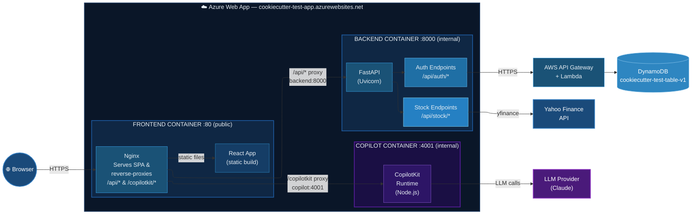

# Azure Deployment Plan — Multi-Container Web App

## Overview

Deploy the full-stack app (frontend, backend, copilot) to Azure using:
- Azure Container Registry (ACR) to host Docker images
- Azure App Service (multi-container) to run them
- Docker Compose to orchestrate the 3 services

## Naming Convention

All resources use the `cookiecutter-test-` prefix.

| Resource             | Name                        |
|----------------------|-----------------------------|
| Resource Group       | `cookiecutter-test-rg`      |
| Container Registry   | `cookiecuttertestacrv1`     |
| App Service Plan     | `cookiecutter-test-plan`    |
| Web App              | `cookiecutter-test-app`     |
| Compose file (local) | `deployment/docker-compose.azure.yml` |

Region: `westus2` (eastus had quota issues; the App Service Plan was created in westus2)

---

## Phase 1 — Authenticate Azure CLI

```bash
az login
az account show
```

## Phase 2 — Create Resource Group

```bash
az group create \
  --name cookiecutter-test-rg \
  --location eastus
```

## Phase 3 — Create Azure Container Registry (ACR)

ACR names must be alphanumeric (no hyphens) and globally unique.

```bash
az acr create \
  --name cookiecuttertestacrv1 \
  --resource-group cookiecutter-test-rg \
  --sku Basic \
  --admin-enabled true
```

Get ACR credentials (needed for Web App to pull images):

```bash
az acr credential show --name cookiecuttertestacrv1
```

## Phase 4 — Build & Push Docker Images to ACR

Login to ACR:

```bash
az acr login --name cookiecuttertestacrv1
```

Build locally first (from deployment/ directory):

```bash
cd deployment && docker compose up --build -d
```

The frontend for Azure uses a separate Dockerfile with Azure-specific nginx config:

```bash
cd ../frontend
docker build -f Dockerfile.azure -t cookiecuttertestacrv1.azurecr.io/stock-frontend:latest .
```

Tag and push each image:

```bash
ACR=cookiecuttertestacrv1.azurecr.io

# Backend (local image name is deployment-backend)
docker tag deployment-backend $ACR/stock-backend:latest
docker push $ACR/stock-backend:latest

# Frontend (already tagged from Dockerfile.azure build above)
docker push $ACR/stock-frontend:latest

# Copilot (local image name is deployment-copilot)
docker tag deployment-copilot $ACR/stock-copilot:latest
docker push $ACR/stock-copilot:latest
```

## Phase 5 — Create Docker Compose for Azure

Create `deployment/docker-compose.azure.yml` with ACR image references.

Azure multi-container Web Apps have constraints:
- Only one container can be exposed to the internet (port 80)
- Inter-container networking uses Docker Compose service names (e.g. `backend`, `copilot`)
- The frontend (nginx) is the public-facing container and proxies to backend/copilot
- The frontend uses `nginx.azure.conf` (same proxy targets as local, identical service names)
- Use `Dockerfile.azure` to build the frontend with the Azure-specific nginx config
- Initial container startup can take 1-2 minutes; API calls may 502 until all containers are ready

```yaml
version: "3.9"

services:
  backend:
    image: cookiecuttertestacrv1.azurecr.io/stock-backend:latest
    expose:
      - "8000"

  copilot:
    image: cookiecuttertestacrv1.azurecr.io/stock-copilot:latest
    expose:
      - "4001"

  frontend:
    image: cookiecuttertestacrv1.azurecr.io/stock-frontend:latest
    ports:
      - "80:80"
    depends_on:
      - backend
      - copilot
```

## Phase 6 — Create App Service Plan

```bash
az appservice plan create \
  --name cookiecutter-test-plan \
  --resource-group cookiecutter-test-rg \
  --sku B1 \
  --is-linux \
  --location westus2
```

## Phase 7 — Create Multi-Container Web App

```bash
az webapp create \
  --name cookiecutter-test-app \
  --resource-group cookiecutter-test-rg \
  --plan cookiecutter-test-plan \
  --multicontainer-config-type COMPOSE \
  --multicontainer-config-file deployment/docker-compose.azure.yml
```

If the compose config is not applied (check `linuxFxVersion` is not null), set it manually:

```bash
COMPOSE_B64=$(base64 -w 0 deployment/docker-compose.azure.yml)
az webapp config set \
  --name cookiecutter-test-app \
  --resource-group cookiecutter-test-rg \
  --linux-fx-version "COMPOSE|${COMPOSE_B64}"
```

Configure ACR credentials for the Web App:

```bash
ACR_PASSWORD=$(az acr credential show --name cookiecuttertestacrv1 --query "passwords[0].value" -o tsv)

az webapp config container set \
  --name cookiecutter-test-app \
  --resource-group cookiecutter-test-rg \
  --container-registry-url https://cookiecuttertestacrv1.azurecr.io \
  --container-registry-user cookiecuttertestacrv1 \
  --container-registry-password "$ACR_PASSWORD"
```

## Phase 8 — Set Environment Variables (Secrets)

Mirror the `.env` file into Azure Web App Application Settings:

```bash
az webapp config appsettings set \
  --name cookiecutter-test-app \
  --resource-group cookiecutter-test-rg \
  --settings \
    CLAUDE_API_KEY=<value> \
    ANTHROPIC_API_KEY=<value> \
    DYNAMODB_API_URL=<value> \
    DYNAMODB_API_KEY=<value>
```

These are injected as environment variables into all containers at runtime.

## Phase 9 — Verify Deployment

```bash
# Check Web App status
az webapp show \
  --name cookiecutter-test-app \
  --resource-group cookiecutter-test-rg \
  --query "state"

# Check logs
az webapp log tail \
  --name cookiecutter-test-app \
  --resource-group cookiecutter-test-rg
```

Test in browser: `https://cookiecutter-test-app.azurewebsites.net`

---

## Teardown — Delete All Azure Resources

To avoid ongoing charges, delete everything by removing the resource group.
This deletes the Web App, App Service Plan, ACR, and all images in one command:

```bash
az group delete \
  --name cookiecutter-test-rg \
  --yes \
  --no-wait
```

To verify deletion:

```bash
az group show --name cookiecutter-test-rg 2>&1
# Should return "Resource group 'cookiecutter-test-rg' could not be found."
```

### Itemized deletion (if you want to keep some resources)

```bash
# Delete Web App only
az webapp delete \
  --name cookiecutter-test-app \
  --resource-group cookiecutter-test-rg

# Delete App Service Plan only
az appservice plan delete \
  --name cookiecutter-test-plan \
  --resource-group cookiecutter-test-rg \
  --yes

# Delete ACR only (removes all images)
az acr delete \
  --name cookiecuttertestacrv1 \
  --resource-group cookiecutter-test-rg \
  --yes

# Delete Resource Group (only if empty or you want everything gone)
az group delete --name cookiecutter-test-rg --yes --no-wait
```

---

## Architecture Diagram



## Cost Estimate

- **App Service Plan B1**: ~$13/month
- **ACR Basic**: ~$5/month
- **Total**: ~$18/month

Delete the resource group when not in use to stop all charges.
