# SYSTEM BLUEPRINT

> This document is the single source of truth for **what** the system is, **why** it exists, and **how** it will be built. Every implementation decision should trace back to a section here.

---

## 1. Project Goal

Users want a simple, self-hosted web application to search for a stock ticker and view its candlestick chart. The entire system runs locally via Docker Compose — no cloud infrastructure required. This is a school-project-grade template that prioritises clarity and simplicity over production hardness.

---

## 2. High-Level Architecture

```mermaid
%%{init: {"flowchart": {"defaultRenderer": "elk"}} }%%

flowchart LR
    subgraph HOST["🖥️ Host Machine — docker-compose.yml"]
        direction LR

        subgraph FE["FRONTEND CONTAINER  :3001 → :80"]
            direction TB
            FE_REACT["React App\n(static build)"]
            FE_NGINX["Nginx\nServes SPA &\nreverse-proxies /api/*"]
        end

        subgraph BE["BACKEND CONTAINER  :8001 → :8000"]
            direction TB
            BE_API["FastAPI\n(Uvicorn)"]
            BE_AUTH["Auth Endpoints\n/api/auth/*"]
            BE_STOCK["Stock Endpoints\n/api/stock/*"]
            BE_CSV[("CSV User Store\nusers.csv")]
        end
    end

    BROWSER(("🌐 Browser"))
    YAHOO["Yahoo Finance\nAPI"]

    BROWSER -- "HTTP :3001" --> FE_NGINX
    FE_NGINX -- "static files" --> FE_REACT
    FE_NGINX -- "/api/* proxy" --> BE_API
    BE_API --> BE_AUTH
    BE_API --> BE_STOCK
    BE_AUTH --> BE_CSV
    BE_STOCK -- "yfinance" --> YAHOO

    %% Blue gradient styles
    style HOST fill:#0a1628,stroke:#1e3a5f,stroke-width:2px,color:#e6edf3
    style FE fill:#0f2744,stroke:#1e5a9f,stroke-width:2px,color:#e6edf3
    style BE fill:#0f2744,stroke:#1e5a9f,stroke-width:2px,color:#e6edf3
    style BROWSER fill:#1a4a7a,stroke:#2e7abf,stroke-width:2px,color:#ffffff
    style YAHOO fill:#1a4a7a,stroke:#2e7abf,stroke-width:2px,color:#ffffff
    style FE_REACT fill:#153d66,stroke:#2980b9,stroke-width:1px,color:#e6edf3
    style FE_NGINX fill:#1a5276,stroke:#3498db,stroke-width:1px,color:#e6edf3
    style BE_API fill:#1a5276,stroke:#3498db,stroke-width:1px,color:#e6edf3
    style BE_AUTH fill:#1f6fa5,stroke:#5dade2,stroke-width:1px,color:#e6edf3
    style BE_STOCK fill:#2580c3,stroke:#7ec8e3,stroke-width:1px,color:#e6edf3
    style BE_CSV fill:#2e86c1,stroke:#85c1e9,stroke-width:1px,color:#ffffff
```



| Layer     | Container | Tech Stack | Exposed Port |
|-----------|-----------|------------|--------------|
| Frontend  | `frontend` | React 18 + TypeScript + Vite, served by Nginx | `3001` (host) → `80` (container) |
| Backend   | `backend`  | Python 3.11+, FastAPI, Uvicorn | `8001` (host) → `8000` (container) |

Nginx inside the frontend container does two jobs:

1. Serves the built React static files.
2. Reverse-proxies any `/api/*` request to the backend container on port `8000` (container-internal), so the browser never talks directly to the backend.

---

## 3. Frontend

### 3.1 Tech Stack

| Concern | Choice |
|---------|--------|
| Framework | React 18 |
| Language | TypeScript (strict mode) |
| Build tool | Vite |
| Styling | CSS Modules (or plain CSS) — dark theme by default |
| HTTP client | `fetch` (native) |
| Charting | [Lightweight Charts](https://github.com/nicehash/lightweight-charts) by TradingView **or** [Plotly.js](https://plotly.com/javascript/) (candlestick trace) |
| Container runtime | Nginx (Alpine) |

### 3.2 Pages / Routes

| Route | Description |
|-------|-------------|
| `/` | **Landing page** — dark-themed hero section with a Login / Register form. |
| `/dashboard` | **Dashboard** — visible only after authentication. Contains a ticker search box and a candlestick chart area. |

### 3.3 Mobile-Adaptive Design

- Use CSS media queries (breakpoints: `768px`, `480px`) or CSS container queries.
- The login form stacks vertically on small screens.
- The candlestick chart resizes to `100%` width of its parent container.
- Navigation (if any) collapses into a hamburger menu on mobile.

### 3.4 Authentication Flow (Frontend Side)

1. User fills in **Register** form (username + password) → `POST /api/auth/register`.
2. User fills in **Login** form (username + password) → `POST /api/auth/login`.
3. Backend returns a JWT token on success.
4. Token is stored in `localStorage` and attached as `Authorization: Bearer <token>` header on subsequent requests.
5. If no valid token is present, the user is redirected to `/`.

### 3.5 Candlestick Chart Flow (Frontend Side)

1. User types a ticker symbol (e.g. `AAPL`) into the search box and clicks **Search**.
2. Frontend sends `GET /api/stock/{ticker}` with the auth header.
3. Backend responds with OHLCV JSON data.
4. Frontend renders a candlestick chart using the charting library.

### 3.6 Dockerfile (Frontend)

```
# Stage 1 — build
FROM node:20-alpine AS build
WORKDIR /app
COPY package*.json ./
RUN npm ci
COPY . .
RUN npm run build          # produces /app/dist

# Stage 2 — serve
FROM nginx:alpine
COPY --from=build /app/dist /usr/share/nginx/html
COPY nginx.conf /etc/nginx/conf.d/default.conf
EXPOSE 80
```

### 3.7 Nginx Config (Key Snippet)

```nginx
server {
    listen 80;

    location / {
        root   /usr/share/nginx/html;
        index  index.html;
        try_files $uri $uri/ /index.html;   # SPA fallback
    }

    location /api/ {
        proxy_pass http://backend:8000/api/;
        proxy_set_header Host $host;
        proxy_set_header X-Real-IP $remote_addr;
    }
}
```

---

## 4. Backend

### 4.1 Tech Stack

| Concern | Choice |
|---------|--------|
| Framework | FastAPI |
| Language | Python 3.11+ |
| ASGI server | Uvicorn |
| Stock data | `yfinance` library (wraps Yahoo Finance) |
| Auth tokens | `python-jose` (JWT) |
| Password hashing | `passlib[bcrypt]` |
| User storage | CSV file on local disk (`data/users.csv`) |
| Data validation | Pydantic v2 (ships with FastAPI) |

### 4.2 API Endpoints

#### Auth

| Method | Path | Body / Params | Response | Description |
|--------|------|---------------|----------|-------------|
| `POST` | `/api/auth/register` | `{ "username": str, "password": str }` | `201` with `{ "message": "registered" }` | Hashes password, appends row to `users.csv`. Returns `409` if username exists. |
| `POST` | `/api/auth/login` | `{ "username": str, "password": str }` | `200` with `{ "access_token": str }` | Verifies credentials against `users.csv`, returns a signed JWT. Returns `401` on bad credentials. |

#### Stock

| Method | Path | Body / Params | Response | Description |
|--------|------|---------------|----------|-------------|
| `GET` | `/api/stock/{ticker}` | Query params: `period` (default `6mo`), `interval` (default `1d`) | `200` with OHLCV JSON array | Requires valid JWT in `Authorization` header. Calls `yfinance` to fetch data. Returns `404` if ticker yields no data. |

### 4.3 User Storage Format (`data/users.csv`)

```csv
username,hashed_password,created_at
alice,$2b$12$...,2026-02-05T12:00:00
```

- The file is read/written using Python's `pandas` library.
- On first boot, if the file does not exist, the backend creates it with the header row.
- Passwords are **never** stored in plain text — only bcrypt hashes.

### 4.4 Yahoo Finance Data Fetching

Using the `yfinance` library (v1.0+):

```python
import yfinance as yf

def fetch_ohlcv(ticker: str, period: str = "6mo", interval: str = "1d") -> list[dict]:
    data = yf.download(
        tickers=ticker,
        period=period,
        interval=interval,
        auto_adjust=True,
        progress=False,
    )
    if data.empty:
        return []
    data = data.reset_index()
    return data[["Date", "Open", "High", "Low", "Close", "Volume"]].to_dict(orient="records")
```

The response JSON looks like:

```json
[
  {
    "Date": "2026-01-02T00:00:00",
    "Open": 150.12,
    "High": 153.45,
    "Low": 149.80,
    "Close": 152.30,
    "Volume": 54321000
  }
]
```

### 4.5 Dockerfile (Backend)

```dockerfile
FROM python:3.11-slim
WORKDIR /app
COPY requirements.txt .
RUN pip install --no-cache-dir -r requirements.txt
COPY . .
EXPOSE 8000
CMD ["uvicorn", "app.main:app", "--host", "0.0.0.0", "--port", "8000"]
```

---

## 5. Docker Compose

```yaml
version: "3.9"

services:
  backend:
    build: ./backend
    container_name: backend
    ports:
      - "8001:8000"           # host 8001 → container 8000 (avoids conflict with port 8000)
    volumes:
      - ./backend/data:/app/data   # persist users.csv across restarts

  frontend:
    build: ./frontend
    container_name: frontend
    ports:
      - "3001:80"             # host 3001 → container 80 (avoids conflict with port 3000)
    depends_on:
      - backend
```

---

## 6. Project Directory Layout

```
full-stack-app-local-cookiecutter/
├── docs/
│   └── CREATE/
│       └── SYSTEM.md              ← you are here
├── frontend/
│   ├── Dockerfile
│   ├── nginx.conf
│   ├── package.json
│   ├── tsconfig.json
│   ├── vite.config.ts
│   ├── index.html
│   └── src/
│       ├── main.tsx
│       ├── App.tsx
│       ├── pages/
│       │   ├── LandingPage.tsx     ← login / register form
│       │   └── Dashboard.tsx       ← ticker search + chart
│       ├── components/
│       │   ├── AuthForm.tsx
│       │   ├── CandlestickChart.tsx
│       │   └── Navbar.tsx
│       ├── services/
│       │   └── api.ts              ← fetch wrappers for /api/*
│       └── styles/
│           └── global.css          ← dark theme defaults
├── backend/
│   ├── Dockerfile
│   ├── requirements.txt
│   ├── data/
│   │   └── users.csv              ← auto-created at runtime
│   └── app/
│       ├── main.py                 ← FastAPI app + CORS
│       ├── routers/
│       │   ├── auth.py             ← /api/auth/*
│       │   └── stock.py            ← /api/stock/*
│       ├── models.py               ← Pydantic schemas
│       ├── auth_utils.py           ← JWT + bcrypt helpers
│       └── stock_utils.py          ← yfinance wrapper
└── docker-compose.yml
```

---

## 7. End-to-End User Walkthrough

1. **User visits `http://localhost:3001`** — Nginx serves the React SPA. The landing page loads with a dark-themed UI and a login/register form.
2. **User registers** — fills in username + password, clicks Register. The frontend `POST`s to `/api/auth/register`. The backend hashes the password, appends a row to `users.csv`, and returns success.
3. **User logs in** — enters credentials, clicks Login. The backend verifies the hash, signs a JWT, and returns it. The frontend stores the token in `localStorage` and navigates to `/dashboard`.
4. **User searches a ticker** — types `AAPL` and clicks Search. The frontend sends `GET /api/stock/AAPL` with the JWT. The backend calls `yfinance`, fetches 6 months of daily OHLCV data, and returns it as JSON.
5. **Chart renders** — the frontend plots a candlestick chart from the OHLCV data. Green candles for up days, red for down days. The chart is responsive and fills the screen width on mobile.

---

## 8. Key Design Decisions and Rationale

| Decision | Why |
|----------|-----|
| CSV for user storage | School project — zero external dependencies; no database server needed. Pandas makes read/write simple. |
| JWT for auth | Stateless — the backend doesn't need session storage. Token lives in the frontend's `localStorage`. |
| Nginx reverse proxy | The browser only talks to one origin (`localhost:3001`), eliminating CORS issues in production. During development, Vite's proxy achieves the same thing. |
| `yfinance` library | Most popular Python wrapper for Yahoo Finance. One-liner to pull OHLCV data. Free, no API key required. |
| Two containers only | Keeps the setup minimal. One `docker-compose up` and the whole app is running. |
| Dark theme | Explicitly requested. Set `background-color: #0d1117` (GitHub-dark style) and light text as the base. |

---

## 9. Open Questions / Future Considerations

- **Charting library choice**: Lightweight Charts (smaller bundle, trading-focused) vs Plotly.js (more chart types, heavier). Decision can be made at implementation time.
- **Period / interval selector**: Currently the frontend sends defaults (`6mo` / `1d`). A dropdown could let users pick different ranges.
- **Logout**: Clear `localStorage` token and redirect to `/`. Simple to add.
- **Error handling on bad ticker**: The backend returns `404` if `yfinance` returns no data. The frontend should show a user-friendly message.
- **Rate limiting**: Yahoo Finance may throttle heavy usage. Not a concern for a school project with light traffic.

---

*This document should be updated as design decisions are finalized during implementation.*
